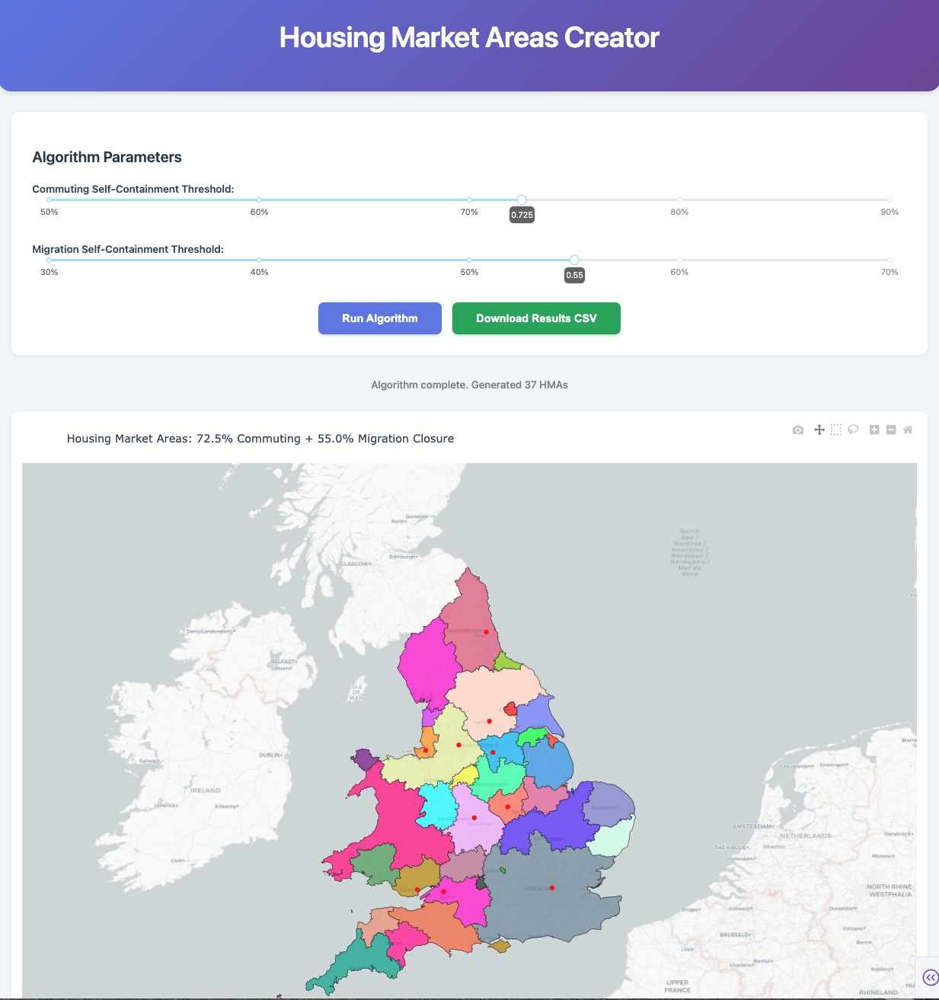

# Creating Housing Market Area
-----------------------------------------------------------------------------------------------------

This project implements a three-stage algorithm to identify Housing Market Areas (HMAs) in England and Wales based on commuting and migration flow data. The fundations for this project is based on the work of Jones et al, 2010

## Overview

The aim is to produce plausible possible housing market area geographies that are produced in a transparent way using consistent criteria, Using communication and migration flow data.

The algorithm ensures identified regions meet self-containment thresholds for both flows. This is the The ratio of internal flow of a region compared to external flows. Output geography is at 2023 local authority level.

## Data

- **Commuting flows**: ONS commuting Origin-destination data, England and Wales 2011 at MSOA level, aggreagated to Local Auhtority 2023 level
- **Migration flows**: ONS Annual mid-year data on internal migration moves for England and Wales, 2023 at local authority level.
We also use 2011 migrations flows at MSOA level to estimate internal migartion for 2023
- **Geographic boundaries**: ONS Local Authority Districts May 2023 UK BFE V2 shapefile


## Methodology

Based on Coombes-Bond (2008) algorithm

### Three-Stage Algorithm

**Stage 1: Commuting-Based Clustering**
- Builds initial regions using commuting flow data
- Uses greedy agglomeration to merge adjacent LAs with strongest connections
- Continues until all regions meet 72.5% commuting self-containment threshold

**Stage 2: Migration Validation**
- Tests Stage 1 regions against migration flows
- Regions must achieve 55% migration self-containment
- Failed regions are dissolved back to individual LAs

**Stage 3: Migration-Based Re-Clustering**
- Re-clusters dissolved LAs using migration flows
- Applies 55% migration self-containment threshold
- Creates alternative groupings 

**Final Output**
- Combines regions that passed Stage 2 with regions from Stage 3
- Verifies all final regions meet both thresholds
- Assigns unique HMA identifiers

### Key Concepts

- **Self-Containment**: Percentage of flows originating in a region that remain within the region

#### Self-Containment Formula

The self-containment rate for a region $R$ is defined as:

$$SC(R) = \frac{\text{moves within } R}{\text{total moves leaving } R}$$

Where:
- **Moves within $R$**: Internal flows where both origin and destination are in the region
- **Total moves leaving $R$**: All outward flows originating from the region

A higher self-containment rate indicates that people moving from the region are more likely to stay within it.

- **Bidirectional Flows**: Sum of flows in both directions between two regions (measures connection strength)
- **Spatial Contiguity**: Only geographically adjacent regions can merge (prevents disconnected areas)
- **Greedy Merging**: Always merges the pair of regions with the strongest connection first


## Files

- **housing_zones_final.ipynb**: Main implementation notebook
- **housing_zone_model_neatened.ipynb**: Alternative version
- **Blueprint_for_creating_housing_zones.ipynb**: Original analysis with extra documentation/methodology
- **housing_zones_dashboard.py**: Interactive Dash web application for exploring different threshold parameters

## Dependencies

```python
pandas
numpy
geopandas
shapely
matplotlib
plotly
```

Install with:
```bash
pip install pandas numpy geopandas shapely matplotlib plotly
```

## Output

The algorithm produces:
- **DataFrame** with LA-level data including:
  - HMA identifier
  - Commuting self-containment percentage
  - Migration self-containment percentage
  - Region size (number of LAs)
  - Geographic data for mapping

## Current Algorithm Parameters in the notebook

- **COMMUTING_THRESHOLD**: 0.725 (72.5% self-containment)
- **MIGRATION_THRESHOLD**: 0.55 (55% self-containment)
- **MAX_ITERATIONS**: 2000 (safety limit)

# Interactive Dashboard

An interactive web dashboard is provided so users can explore how different threshold parameters affect construction of the resulting Housing Market Areas.

## *Please note*: 
This dashboard is in it's beta proof of concept version. It will need a lot more work in regards to styling, functionality, bug testing and user experience before it is deloyed publicly



### Running the Dashboard

```bash
python housing_zones_dashboard.py
```

The dashboard will start on `http://127.0.0.1:8051`
  
**Data Export**: 
  - Download results as CSV including LA codes, names, HMA assignments, and self-containment scores, so the exact housing regions can be recreated.

### Dashboard Dependencies

Additional requirements beyond the core analysis:
```bash
pip install dash plotly
```

The dashboard uses the same algorithm created in the notebooks but provides an interactive interface for parameter exploration.

## Contact

For questions or feedback, please reach out to [sebastian.heslin-rees@london.gov.uk].

---

## License
Shield: [![CC BY-NC 4.0][cc-by-nc-shield]][cc-by-nc]

This work is licensed under a
[Creative Commons Attribution-NonCommercial 4.0 International License][cc-by-nc].

[![CC BY-NC 4.0][cc-by-nc-image]][cc-by-nc]

[cc-by-nc]: https://creativecommons.org/licenses/by-nc/4.0/
[cc-by-nc-image]: https://licensebuttons.net/l/by-nc/4.0/88x31.png
[cc-by-nc-shield]: https://img.shields.io/badge/License-CC%20BY--NC%204.0-lightgrey.svg

please email [sebastian.heslin-rees@london.gov.uk] for license infomation.

---

